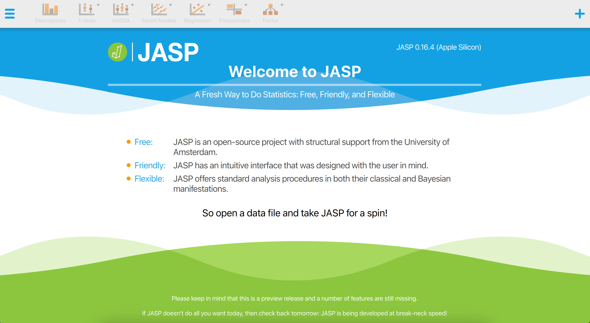

---
output:
  bookdown::html_document2:
    fig_caption: yes
editor_options:
  chunk_output_type: console
---

```{r echo = FALSE, cache = FALSE}
source("utils.R", local = TRUE)
```

# Other Software {#CHAPTER-8}

This chapter discusses other R-related open-source software implementing
statistical techniques for audit sampling.

## JASP for Audit (GUI)

JASP for Audit [@derks2021_jasp] is an add-on module for
[JASP](http://jasp-stats.org/) [@JASP], based on the **jfa** package, that
facilitates statistical audit sampling. Concretely, it contains graphical user
interfaces (GUI's) for calculating sample sizes, selecting items according to
standard audit sampling techniques, and performing inference about the
population misstatement on the basis of a data sample or summary statistics of a
sample. The module also features Bayesian equivalents of these analyses that
enable the user to easily incorporate prior information into the statistical
procedure. In all analyses, the Audit module offers explanatory text that helps
the auditor in interpreting, explaining, and reporting the analysis. Since JASP
for Audit is an R-based GUI around **jfa**, its functionality can be mapped
almost one-on-one to that of the package.

<center>



</center>

## MUS (R)

**MUS** [@MUS] is an R package proving sampling and evaluation methods to apply
Monetary Unit Sampling during an audit of financial statements. The package is
available via [CRAN](https://cran.r-project.org/package=MUS) and can be
downloaded with:

```{r, eval=FALSE}
install.packages("MUS")
```
