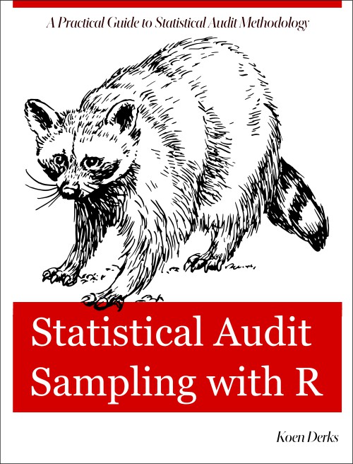

# Welcome {-}

Welcome to the book **Statistical Auditing with R**, a practical guide for
auditors that want to use state-of-the-art statistical methodology in the audit.
This book focuses on two auditing procedures that are commonly performend in a
statistical manner: audit sampling and data auditing. It explains the underlying
statistical auditing theory from a classical and Bayesian point of view and
demonstrates how to perform these procedures in a sound manner compliant with
international auditing standards using the **jfa** R package.

Please keep in mind that this is a preview release and a number of chapters are
still missing. If you are missing some of the content today, then check back
tomorrow: This book is actively being worked on.
